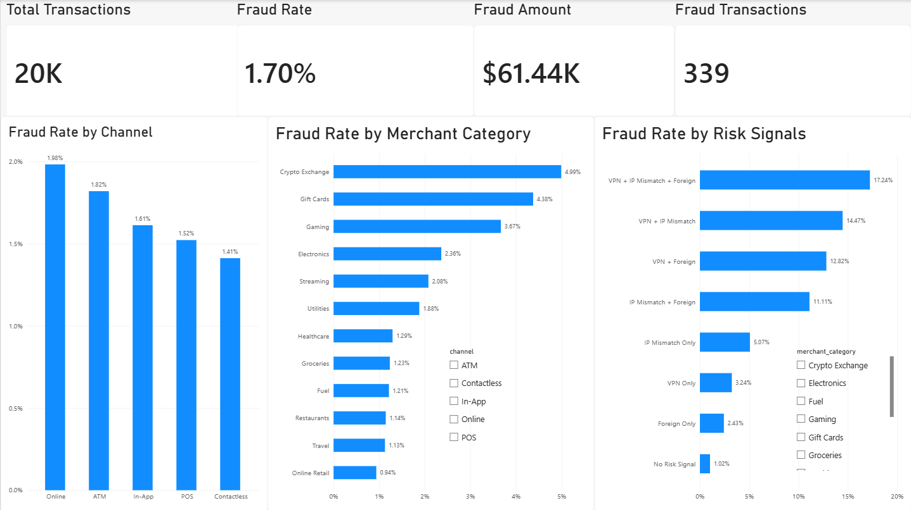

# Credit Card Fraud Analysis

## Project Overview

This project analyzes a credit card transaction dataset to identify patterns associated with fraudulent activity. The work combines a pandas-based exploratory analysis in Jupyter Notebook with an interactive Power BI dashboard designed for fast operational review.

The analysis focuses on four questions:

- How common is fraud in the dataset?
- How do fraudulent and non-fraudulent transaction amounts differ?
- Which transaction channels and merchant categories have higher observed fraud rates?
- How does fraud risk change when multiple risk signals occur together?

This is a descriptive data analysis project. It does not include machine learning or SQL analysis.

## Dataset

The dataset contains **20,000 transactions and 26 fields**, including:

- Transaction identifiers and amounts
- Merchant category, card type, authentication method, and transaction channel
- Device and location-related indicators
- Transaction velocity and customer/account attributes
- Risk signals such as VPN usage, IP country mismatch, and foreign transaction status
- A binary fraud label (`is_fraud`)

**Dataset Name:** Credit Card Fraud Detection 2026

**Source:** Kaggle

**Author:** Udit Jain

**License:** CC0: Public Domain

**Dataset Link:** [Credit Card Fraud Detection 2026 on Kaggle](https://www.kaggle.com/datasets/uditjain13/credit-card-fraud-detection-2026)

The original CSV is retained without modification.

## Tools

- **Python** — analysis workflow
- **pandas** — data loading, validation, grouping, and aggregation
- **Jupyter Notebook** — documented exploratory data analysis
- **Power BI** — KPI reporting, visual analysis, and interactive filtering

## Data Cleaning

The notebook performs the following data-quality checks before analysis:

- Reviews the dataset dimensions and column data types
- Checks all columns for missing values
- Checks for duplicate rows
- Reviews the distribution of the fraud label

The checks found **no missing values and no duplicate rows**. No imputation, duplicate removal, or modification of the original CSV was required.

## Exploratory Data Analysis

The pandas analysis is organized into the following stages:

1. Data loading and initial inspection
2. Dataset structure and quality validation
3. Transaction and fraud overview
4. Transaction amount comparison
5. Fraud rate by transaction channel
6. Fraud rate by merchant category
7. Fraud rate by individual and combined risk signals

The complete workflow and saved outputs are available in the [Jupyter Notebook](notebooks/credit_card_fraud_analysis.ipynb).

## Dashboard

The Power BI report provides a one-page overview with:

- Total Transactions
- Fraud Transactions
- Fraud Rate
- Fraud Amount
- Fraud Rate by Channel
- Fraud Rate by Merchant Category
- Fraud Rate by Risk Signals
- Channel and merchant-category slicers

The report file is available at [powerbi/credit-card-fraud-analysis.pbix](powerbi/credit-card-fraud-analysis.pbix). GitHub cannot preview PBIX files directly, so the report must be opened in Power BI Desktop.



## Key Findings

- The dataset contains **339 fraudulent transactions out of 20,000**, producing an overall fraud rate of **1.695%**.
- Fraudulent transactions have a higher average amount (**$181.25**) than non-fraudulent transactions (**$131.58**). Their median amounts are **$69.77** and **$57.35**, respectively.
- **Online** has the highest observed channel fraud rate at **1.98%** and also has the largest transaction volume, with **6,810 transactions**.
- **Crypto Exchange (4.99%)**, **Gift Cards (4.38%)**, and **Gaming (3.67%)** have the three highest observed merchant-category fraud rates.
- Foreign transactions have a higher observed fraud rate than domestic transactions (**5.89% vs. 1.42%**).
- Transactions using a VPN have a higher observed fraud rate than transactions without VPN usage (**4.38% vs. 1.44%**).
- Transactions with an IP country mismatch have a higher observed fraud rate than transactions without a mismatch (**7.80% vs. 1.32%**).
- Transactions where VPN usage, IP country mismatch, and foreign-transaction status all occur together have the highest observed combined-signal fraud rate (**17.24%**), but this segment contains only **29 transactions** and should be interpreted cautiously.

These findings describe associations within this dataset and should not be interpreted as proof that any single factor causes fraud.

## Business Recommendations

- Prioritize online transactions for monitoring because this channel combines the highest observed fraud rate with the largest transaction volume.
- Apply additional review to higher-risk merchant categories such as Crypto Exchange, Gift Cards, and Gaming while considering both fraud rate and segment size.
- Use foreign-transaction status, VPN usage, and IP country mismatch as combined review signals rather than stand-alone blocking rules.
- Escalate transactions with multiple overlapping risk signals to stronger verification or manual review.
- Track transaction counts alongside fraud rates so that small segments do not drive disproportionate policy decisions.
- Monitor false positives and customer impact when adjusting fraud controls, especially for legitimate international customers.

## Project Structure

```text
credit-card-fraud-analysis/
├── README.md
├── .gitignore
├── data/
│   └── credit_card_fraud_2026.csv
├── notebooks/
│   └── credit_card_fraud_analysis.ipynb
├── powerbi/
│   └── credit-card-fraud-analysis.pbix
└── images/
    └── dashboard-overview.png
```
